# 🏭 Simulazione Impianto di Imbottigliamento OPC-UA

Un sistema industriale completo per la simulazione e controllo di un impianto di imbottigliamento utilizzando il protocollo OPC-UA con architettura professionale e interfacce moderne.

## 📋 Indice

- [🎯 Panoramica](#-panoramica)
- [🏗️ Architettura](#️-architettura)
- [🚀 Quick Start](#-quick-start)
- [📊 Componenti del Sistema](#-componenti-del-sistema)
- [🔧 Guida Dettagliata](#-guida-dettagliata)
- [📈 Dashboard e Monitoraggio](#-dashboard-e-monitoraggio)
- [🛠️ Sviluppo e Customizzazione](#️-sviluppo-e-customizzazione)
- [❓ Troubleshooting](#-troubleshooting)

## 🎯 Panoramica

### Caratteristiche Principali

✅ **Architettura OPC-UA Industriale** - Standard di settore per automazione  
✅ **Simulazione Real-time** - 6 nastri trasportatori + riempitrice  
✅ **Dashboard Moderna** - KPI, analytics e indicatori visivi  
✅ **Controllo Remoto** - Accensione/spegnimento e cambio parametri  
✅ **Aggregazione Dati** - Consumo totale, produzione, efficienza  
✅ **Custom Types** - Metadati professionali e unità di misura  
✅ **Localizzazione Italiana** - Interfacce e descrizioni in italiano  

### Tecnologie Utilizzate

- **Framework**: .NET 8.0
- **Protocollo**: OPC-UA (OPC Foundation .NET Standard)
- **Architettura**: Client-Server distribuita
- **UI**: Console con emoji e indicatori colorati
- **Persistence**: In-memory (real-time simulation)

## 🏗️ Architettura

### Panoramica del Sistema

```mermaid
graph TB
    subgraph "OPC-UA Servers"
        NS[NastriServer<br/>📊 6 Nastri<br/>Port: 4841]
        RS[RiempitriceServer<br/>🏭 Riempitrice<br/>Port: 4843]
    end
    
    subgraph "OPC-UA Clients"
        CA[ClientAggregatore<br/>📈 Dashboard & KPI]
        CI[ControlloImpianto<br/>🎛️ Controllo Remoto]
    end
    
    subgraph "Shared Libraries"
        SH[Shared<br/>🔧 Custom Types & Enums]
    end
    
    NS -.-> CA
    RS -.-> CA
    NS -.-> CI
    RS -.-> CI
    SH --> NS
    SH --> RS
    SH --> CA
```



### Struttura dei Progetti

```
simulazione-esame/
├── 📁 NastriServer/           # Server OPC-UA per nastri trasportatori
├── 📁 RiempitriceServer/      # Server OPC-UA per riempitrice
├── 📁 ClientAggregatore/      # Client per dashboard e analytics
├── 📁 ControlloImpianto/      # Client per controllo remoto
├── 📁 Shared/                 # Libreria condivisa con custom types
└── 📄 OpcUaImpianto.sln      # Solution file
```

## 🚀 Quick Start

### Prerequisiti

- .NET 8.0 SDK
- Windows/Linux/macOS
- Porte 4841 e 4843 disponibili

### Installazione e Avvio

1. **Clone del repository**
```bash
git clone <repository-url>
cd simulazione-esame
```

2. **Build del progetto**
```bash
dotnet build
```

3. **Avvio dei server** (in terminali separati)
```bash
# Terminal 1 - Server Nastri
dotnet run --project NastriServer

# Terminal 2 - Server Riempitrice  
dotnet run --project RiempitriceServer
```

4. **Avvio dei client** (in terminali separati)
```bash
# Terminal 3 - Dashboard Aggregazione
dotnet run --project ClientAggregatore

# Terminal 4 - Controllo Impianto
dotnet run --project ControlloImpianto
```

### Verifica Funzionamento

✅ **Server Nastri**: `opc.tcp://localhost:4841/NastriServer`  
✅ **Server Riempitrice**: `opc.tcp://localhost:4843/RiempitriceServer`  
✅ **Dashboard attiva**: Aggiornamenti ogni 5 secondi  
✅ **Controllo disponibile**: Menu interattivo  

## 📊 Componenti del Sistema

### 1. 🎚️ NastriServer - Server Nastri Trasportatori

**Endpoint**: `opc.tcp://localhost:4841/NastriServer`

#### Struttura Nodi OPC-UA
```
Objects/
└── Nastri/
    ├── Nastro1/
    │   ├── Stato (Int32) - 0=Spento, 1=InFunzione, 2=InAllarme
    │   ├── Velocita (Float, RW) - Velocità in m/min [0-100]
    │   ├── ConsumoElettrico (Float) - Consumo in kW [0-50]
    │   ├── ContatoreBottiglie (UInt32) - Bottiglie processate
    │   ├── Acceso (Boolean, RW) - Comando accensione
    │   ├── Automatico (Boolean, RW) - Modalità automatica
    │   ├── TempoFunzionamento (Double) - Ore di funzionamento
    │   └── NumeroAvvii (UInt32) - Contatore avvii
    ├── Nastro2/ ... Nastro6/
    └── (stessa struttura per tutti i 6 nastri)
```

#### Caratteristiche Tecniche
- **Simulazione Real-time**: Aggiornamento ogni 2 secondi
- **Logica Automatica**: Cambio stati casuali (5% probabilità allarme)
- **Contatori Incrementali**: Bottiglie processate automaticamente
- **Controllo Remoto**: Variabili scrivibili per accensione/controllo

### 2. 🏭 RiempitriceServer - Server Riempitrice

**Endpoint**: `opc.tcp://localhost:4843/RiempitriceServer`

#### Struttura Nodi OPC-UA
```
Objects/
└── Riempitrice/
    ├── Parametri/
    │   ├── Stato (Int32) - 0=Spenta, 1=Accesa, 2=InFunzione, 3=InAllarme
    │   ├── RicettaInUso (String) - Ricetta attiva
    │   ├── VelocitaRiempimento (Float, RW) - bot/min [0-200]
    │   ├── ConsumoElettrico (Float) - Consumo kW [0-100]
    │   └── ContatoreBottiglieRiempite (UInt32) - Bottiglie riempite
    ├── Ricette/
    │   └── RicetteDisponibili (String[]) - Array ricette
    ├── Controllo/
    │   ├── Accesa (Boolean, RW) - Comando accensione
    │   └── CambiaRicetta (String, RW) - Cambio ricetta
    └── Diagnostica/
        ├── TempoFunzionamento (Double) - Ore funzionamento
        ├── NumeroAvvii (UInt32) - Contatore avvii
        └── Efficienza (Float) - Efficienza % [0-100]
```

#### Ricette Disponibili
- **Acqua Naturale** 💧
- **Acqua Frizzante** 🫧
- **Coca Cola** 🥤
- **Succo Arancia** 🍊
- **Energy Drink** ⚡

### 3. 📈 ClientAggregatore - Dashboard e Analytics

#### Dashboard Principal
```
=== 🏭 DASHBOARD AGGREGAZIONE IMPIANTO ENHANCED ===
🕒 Ultimo aggiornamento: 14:25:33

🟢 STATO SISTEMA: Operativo
⚡ CONSUMO COMPLESSIVO: 15.4 kW
🍾 BOTTIGLIE PROCESSATE: 1247
⚠️ ANOMALIE CONTATORI: NO

📊 NASTRI ENHANCED:
   Operativi: 4/6 | Spenti: 2/6 | In allarme: 0/6
   🟢 Nastro 1: 2.1kW | 156 bot
   🟢 Nastro 2: 3.2kW | 203 bot
   ⚪ Nastro 3: 0.0kW | 87 bot
   ...

🏭 RIEMPITRICE ENHANCED:
   🟢 Stato: InFunzione | Ricetta: Coca Cola
   ⚡ Consumo: 7.8kW | 🍾 Riempite: 589
```

#### KPI e Analytics Avanzati
- **Efficienza Nastri**: Percentuale nastri operativi
- **Produttività Oraria**: Stima bottiglie/ora
- **Intensità Energetica**: kW per bottiglia
- **Bilanciamento Carico**: Differenza consumo min-max
- **Anomalie Real-time**: Rilevamento automatico

### 4. 🎛️ ControlloImpianto - Controllo Remoto

#### Menu Controllo
```
=== MENU CONTROLLO ENHANCED ===
1. Accendi tutti i nastri
2. Spegni tutti i nastri  
3. Accendi nastri 1-3
4. Accendi riempitrice
5. Spegni riempitrice
6. Controllo singolo nastro
7. Cambia ricetta riempitrice
8. Stato attuale Enhanced
9. Test controllo Enhanced
0. Mostra struttura completa
```

#### Funzionalità di Controllo
- **Accensione/Spegnimento**: Singoli nastri o completo
- **Cambio Ricette**: 5 ricette predefinite
- **Stato Real-time**: Lettura tutti i parametri
- **Debug Avanzato**: Esplorazione struttura OPC-UA
- **Test Automatici**: Sequenze di controllo programmate

## 🔧 Guida Dettagliata

### Struttura Custom Types (Shared/CustomTypes.cs)

Il sistema utilizza custom types professionali per garantire:

#### ProfessionalNodeCreator
```csharp
// Creazione variabili con metadati completi
CreateProfessionalVariable(
    parent: nastroObj,
    nodeId: "Consumo1", 
    browseName: "ConsumoElettrico",
    displayName: "Consumo Elettrico",
    description: "Consumo elettrico istantaneo del nastro",
    dataType: DataTypeIds.Float,
    unit: "kW",
    minValue: 0.0,
    maxValue: 50.0
);
```

#### IndustrialComponentTemplates
Template predefiniti per:
- **Nastri Trasportatori**: Struttura completa con parametri/controllo/diagnostica
- **Riempitrice**: Gestione ricette e parametri avanzati
- **Impianto**: Dati aggregati e KPI sistema

### Logica di Simulazione

#### Nastri Trasportatori
```csharp
public void Aggiorna()
{
    if (!Acceso) {
        Stato = StatoNastro.Spento;
        ConsumoElettrico = 0.0f;
        return;
    }
    
    // 5% probabilità allarme
    if (Random.Shared.NextDouble() < 0.05) {
        Stato = StatoNastro.InAllarme;
    } else {
        Stato = StatoNastro.InFunzione;
        ConsumoElettrico = Random.Shared.NextSingle() * 2.0f + 1.0f; // 1-3 kW
        
        // 30% probabilità incremento bottiglie
        if (Random.Shared.NextDouble() < 0.3) {
            ContatoreBottiglie++;
        }
    }
}
```

#### Aggregazione Dati
```csharp
// Calcolo stato sistema
var nastriInAllarme = nastri.Count(n => n.Stato == StatoNastro.InAllarme);
var nastriOperativi = nastri.Count(n => n.Stato == StatoNastro.InFunzione);

StatoSistema = nastriInAllarme >= 3 ? StatoSistema.AllarmeGenerale :
               nastriInAllarme > 0 ? StatoSistema.ParzialeAllarme :
               nastriOperativi > 0 ? StatoSistema.Operativo : 
               StatoSistema.Spento;
```

### Gestione Errori e Robustezza

#### Multi-level Node Discovery
```csharp
// Il sistema cerca nodi con multiple strategie
var possibiliNodi = new string[] {
    $"Objects/2:Nastri/2:Nastro{i}/2:Acceso",        // Struttura Enhanced
    $"Nastro{i}_Controllo_Acceso",                   // Struttura alternative
    $"Acceso{i}"                                      // NodeId diretto
};

// Fallback con NodeId diretto se path non funziona
var nodeIdDiretto = new NodeId($"Acceso{i}", 2);
await ScriviNodo(nodeIdDiretto, true, session);
```

#### Doppia Registrazione Chiavi
```csharp
// Registra sia chiave completa che semplificata
nodeIds[currentPath] = nodeId;  // "Objects/2:Nastri/2:Nastro1/2:Acceso"
nodeIds[simpleKey] = nodeId;    // "Acceso1"
```

## 📈 Dashboard e Monitoraggio

### KPI Principali

| Metrica | Descrizione | Calcolo |
|---------|-------------|---------|
| **Stato Sistema** | Stato operativo aggregato | Basato su allarmi attivi |
| **Consumo Totale** | Somma consumi tutti componenti | ΣConsumo nastri + riempitrice |
| **Efficienza Nastri** | % nastri operativi | (Nastri operativi / 6) × 100 |
| **Produttività Oraria** | Stima bottiglie/ora | Bottiglie totali × 12 |
| **Intensità Energetica** | kW per bottiglia | Consumo totale / bottiglie |
| **Bilanciamento Carico** | Uniformità distribuzione | Max consumo - Min consumo |

### Report Dettagliato

Il sistema genera report completi con:
- **Analisi Performance**: Efficienza individuale nastri
- **Diagnostica Avanzata**: Tempi funzionamento, cicli, allarmi
- **Trend Analysis**: Confronto dati storici
- **Raccomandazioni**: Suggerimenti ottimizzazione

### Indicatori Visivi

- 🟢 **Verde**: Componente operativo/normale
- 🟡 **Giallo**: Componente acceso ma non in funzione
- 🔴 **Rosso**: Componente in allarme/errore
- ⚪ **Bianco**: Componente spento
- ⚠️ **Warning**: Anomalie rilevate

## 🛠️ Sviluppo e Customizzazione

### Aggiungere Nuovi Componenti

1. **Definire il modello dati** in `Shared/`
```csharp
public class NuovoComponente
{
    public int Id { get; set; }
    public string Nome { get; set; }
    public StatoComponente Stato { get; set; }
    // ... altre proprietà
}
```

2. **Creare template professionale** in `CustomTypes.cs`
```csharp
public static BaseObjectState CreateProfessionalComponente(
    NodeState parent, string nome, ushort namespaceIndex)
{
    // Implementazione template
}
```

3. **Implementare server OPC-UA**
```csharp
public class ComponenteOpcServer : StandardServer
{
    // Implementazione server
}
```

4. **Aggiornare client aggregatore**
```csharp
// Aggiungere lettura dati nel ClientAggregatore
// Includere nei calcoli KPI
```

### Estendere Funzionalità

#### Eventi OPC-UA
```csharp
// Aggiungere eventi per notifiche real-time
var alarmEvent = new AlarmConditionState(null);
alarmEvent.Initialize(context, source, EventTypes.AlarmConditionType, ...);
```

#### Subscription
```csharp
// Subscription per notifiche push invece di polling
var subscription = new Subscription(session.DefaultSubscription);
subscription.PublishingInterval = 1000;
subscription.Create();
```

#### Persistenza Dati
```csharp
// Salvataggio storico per trend analysis
public void SalvaStoricoSuDatabase(DatiAggregati dati)
{
    // Implementazione persistenza
}
```

### Configurazioni Avanzate

#### Sicurezza OPC-UA
```csharp
SecurityConfiguration = new SecurityConfiguration {
    AutoAcceptUntrustedCertificates = false, // Per produzione
    ApplicationCertificate = certificato,
    SecurityPolicies = { SecurityPolicies.Basic256Sha256 }
}
```

#### Performance Tuning
```csharp
TransportQuotas = new TransportQuotas() {
    OperationTimeout = 30000,        // Timeout operazioni
    MaxMessageSize = 8388608,        // 8MB message size
    MaxStringLength = 2097152,       // 2MB string max
    ChannelLifetime = 600000         // 10 min channel lifetime
}
```

## ❓ Troubleshooting

### Problemi Comuni e Soluzioni

#### 🔌 Errori di Connessione

**Problema**: `Could not connect to server`
```bash
# Verificare che i server siano avviati
dotnet run --project NastriServer
dotnet run --project RiempitriceServer

# Controllare porte disponibili
netstat -an | findstr :4841
netstat -an | findstr :4843
```

**Soluzione**: 
- Verificare firewall Windows/Linux
- Controllare antivirus
- Usare `localhost` invece di IP specifici

#### 🔍 Nodi Non Trovati

**Problema**: `❌ Non trovato nodo Acceso per Nastro X`

**Debug**:
```bash
# Usare opzione 0 nel ControlloImpianto per vedere struttura completa
# Verificare che DebugClient.cs abbia maxLevel = 4
```

**Soluzione**:
- Verificare che il server sia completamente avviato
- Controllare log server per errori creazione nodi
- Riavviare server se necessario

#### 📊 Dashboard Non Si Aggiorna

**Problema**: Dati statici nel ClientAggregatore

**Debug**:
```csharp
// Verificare che il timer sia attivo
Console.WriteLine($"Timer attivo: {timerAggregazione != null}");

// Controllare connessioni
Console.WriteLine($"Sessione nastri: {sessionNastri?.Connected}");
Console.WriteLine($"Sessione riempitrice: {sessionRiempitrice?.Connected}");
```

**Soluzione**:
- Riavviare ClientAggregatore
- Verificare connessioni di rete
- Controllare log per errori di lettura

#### ⚡ Performance Issues

**Problema**: Alta latenza o blocchi

**Ottimizzazioni**:
```csharp
// Ridurre frequenza aggiornamenti
TimeSpan.FromSeconds(10)  // invece di 5

// Batch delle letture OPC-UA
var nodesToRead = new ReadValueIdCollection();
// Aggiungi tutti i nodi
session.Read(null, 0, TimestampsToReturn.Both, nodesToRead, ...);
```

#### 🚫 Errori di Scrittura

**Problema**: `❌ Errore scrittura Enhanced`

**Debug**:
```csharp
// Verificare AccessLevel della variabile
var accessLevel = variable.AccessLevel;
Console.WriteLine($"Access Level: {accessLevel}");

// Controllare tipo dato
Console.WriteLine($"Data Type: {variable.DataType}");
Console.WriteLine($"Value Type: {value.GetType()}");
```

**Soluzione**:
- Verificare che la variabile sia scrivibile (AccessLevel.CurrentWrite)
- Controllare tipo dato compatibile
- Verificare che il server accetti il valore

### Log e Debug

#### Abilitare Debug Dettagliato
```csharp
// In Program.cs di ogni progetto
Console.WriteLine($"🔧 Debug: {operazione} su {nodeId}");
```

#### File di Log
```bash
# Reindirizzare output su file per analisi
dotnet run --project NastriServer > nastri.log 2>&1
dotnet run --project ClientAggregatore > client.log 2>&1
```

### Supporto e Risorse

#### Documentazione OPC-UA
- [OPC Foundation .NET Standard](https://github.com/OPCFoundation/UA-.NETStandard)
- [OPC-UA Specification](https://opcfoundation.org/about/opc-technologies/opc-ua/)

#### Tool di Debug OPC-UA
- **UaExpert**: Client OPC-UA professionale per test
- **Prosys OPC Expert**: Tool completo per sviluppo OPC-UA

#### Community
- [OPC Foundation GitHub](https://github.com/OPCFoundation)
- [Stack Overflow - OPC-UA](https://stackoverflow.com/questions/tagged/opc-ua)

---

## 🏆 Conclusioni

Questo sistema rappresenta un'implementazione **industriale completa** di un impianto di imbottigliamento con:

✅ **Architettura OPC-UA Standard** - Protocollo industriale de facto  
✅ **Metadati Professionali** - Custom types e unità di misura  
✅ **Dashboard Moderna** - KPI avanzati e analytics real-time  
✅ **Controllo Robusto** - Fallback intelligenti e gestione errori  
✅ **Scalabilità** - Facilmente estendibile per nuovi componenti  

Il progetto dimostra competenze professionali nell'automazione industriale e può servire come base per implementazioni reali in ambiente manifatturiero.

---

**Sviluppato con ❤️ per l'industria 4.0**

*Per domande o supporto, consultare la sezione Troubleshooting o riferirsi alla documentazione OPC Foundation.*